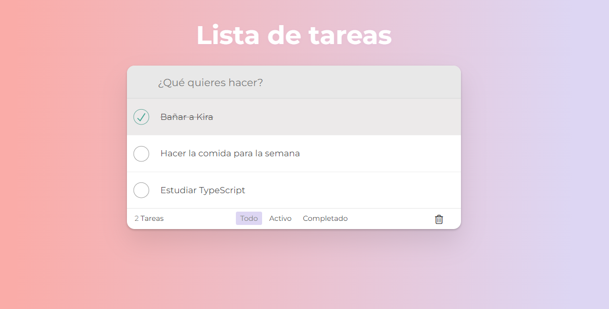
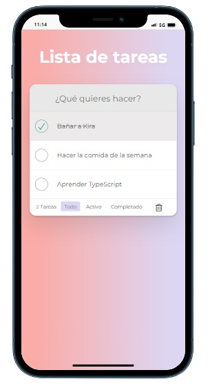

# To Do List with React + TypeScript + Vite

This is a web application to keep your ideas in order, create a to-do list. I have done it to learn and practice typeScript with REACT.

 

## 📋 Initial Requeriments

- List all TODOs
- Being able to delete an EVERYTHING
- Mark EVERYTHING as completed
- Add way to filter ALLs (Footer)
- Show number of pending TODOs (Footer)
- Add way to delete all completed TODOs
- Create Header with input (Header)
- Create a TODO (Header)
 
## 🔨 Built with

- **Visual Studio Code**
- **REACT**
- **VITE** 
- **TypeScript**

This template provides a minimal setup to get React working in Vite with HMR and some ESLint rules.

Currently, two official plugins are available:

- [@vitejs/plugin-react](https://github.com/vitejs/vite-plugin-react/blob/main/packages/plugin-react/README.md) uses [Babel](https://babeljs.io/) for Fast Refresh
- [@vitejs/plugin-react-swc](https://github.com/vitejs/vite-plugin-react-swc) uses [SWC](https://swc.rs/) for Fast Refresh

## Expanding the ESLint configuration

If you are developing a production application, we recommend updating the configuration to enable type aware lint rules:

- Configure the top-level `parserOptions` property like this:

```js
export default {
  // other rules...
  parserOptions: {
    ecmaVersion: 'latest',
    sourceType: 'module',
    project: ['./tsconfig.json', './tsconfig.node.json'],
    tsconfigRootDir: __dirname,
  },
}
```

- Replace `plugin:@typescript-eslint/recommended` to `plugin:@typescript-eslint/recommended-type-checked` or `plugin:@typescript-eslint/strict-type-checked`
- Optionally add `plugin:@typescript-eslint/stylistic-type-checked`
- Install [eslint-plugin-react](https://github.com/jsx-eslint/eslint-plugin-react) and add `plugin:react/recommended` & `plugin:react/jsx-runtime` to the `extends` list

## ✏️ Do you have any idea? 

I'm an student and as I stated before am learning a whole lot of Front End Developing, so, if  you have any idea that I could develope please tell me so and I will try to.

## 🙍‍♀️ Autor

[)](https://github.com/crisrodriguezgar)

## 🏆 Codefactor

[](https://www.codefactor.io/repository/github/crisrodriguezgar/todolist_typescript)

### Enjoy it!
